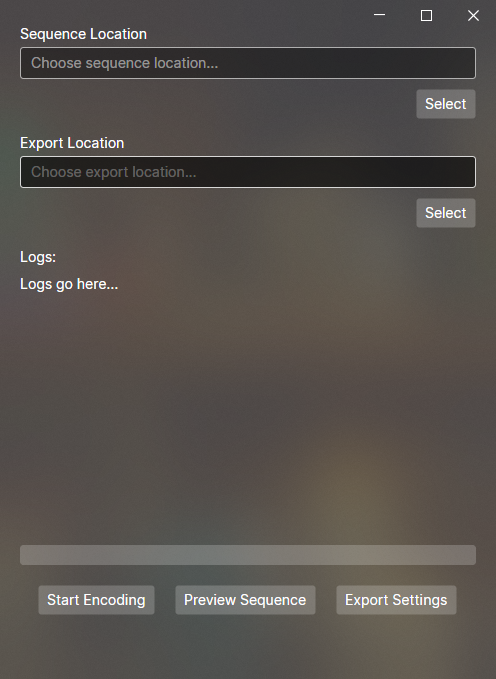

# Thirty Dollar Tools

This project contains tools related to the 
[Thirty Dollar Website](https://thirtydollar.website/) 
that help creators make better and more complex covers,
and users have more enjoyment experiencing public covers and _"particle accelerators"_, 
**free of the lag that you might encounter on the Thirty Dollar Website.** 

The wiki also has some useful information if you're planning on using these tools.
[Here's the link](https://github.com/t1stm/ThirtyDollarTools/wiki)

## Projects you're most likely going to be interested in: 

## Thirty Dollar Visualizer

The **Thirty Dollar Visualizer** is a tool that replicates the **Thirty Dollar Website's playback**.
It plays compositions using multiple CPU threads allowing it to
achieve much higher note density and performance, than the website can achieve.

[More info about the visualizer here.](ThirtyDollarVisualizer/README.md)

## Thirty Dollar Converter

The **Thirty Dollar Converter** is a tool that perfectly 
outputs a Thirty Dollar Composition to a WAVE audio file.
It's the perfect way to make a **high quality export of an audio file 
from a sequence, to use in a video** or somewhere else, since it 
doesn't rely on the performance enhancements the 
audio engine of the Thirty Dollar Website uses.

The only limitation is your system's RAM capacity and 
the time you can leave your device powered on.

[See more info about the converter here.](ThirtyDollarConverter.GUI/README.md)

[_Or if you're interested in the CLI program, here._](ThirtyDollarConverter.Debug/README.md)

## Download

If you want to download these tools, you can visit the
[release tab](https://github.com/t1stm/ThirtyDollarTools/releases) and download the 
latest copy of the compiled projects, or you can compile this project from the source code.

The **officially supported operating systems** are **Windows x64** and **Linux x64**, but I also include builds for **macOS x64/ARM**
