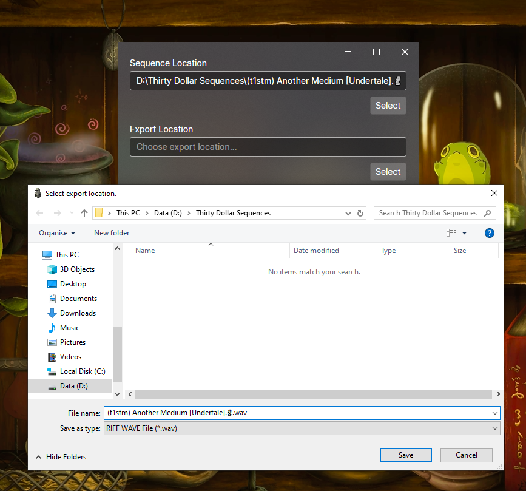

# Thirty Dollar Converter (GUI edition)

Converts TDW sequences and TDWex sequences to audible file formats (currently only Wave files).

## Usage

### Downloading And Running
You can get a _compiled_ copy of this application at the [releases tab](https://github.com/t1stm/ThirtyDollarTools/releases). 
Once you've downloaded it, you can open the ThirtyDollarGUI executable, and if it's your first time running it,
make it to download all TDW samples, by pressing the download button.

### Select Files

Afterwards if you want to encode something, you first select the sequence file.

And also select the export location.

After that you should have the following message: `Preloaded sequence located in: ...`

### Export Settings

Optionally you can change the "Export Settings", if you want to change some effects.
I'll now explain the fields, and if you aren't interested skip over to the **Encoding Section**

| Field Name              | Description                                                                                                                                                                 | Default Value     |
|-------------------------|-----------------------------------------------------------------------------------------------------------------------------------------------------------------------------|-------------------|
| `Sample Rate`           | Changes the exported audio file's sample rate.                                                                                                                              | 48000             |
| `Channels`              | Amount of channels. Currently only 1 or 2 are supported.                                                                                                                    | 2                 |
| `Cut Event Delay`       | The amount of crossfade the cut element does. Proper TDW behavior should be "0", but it causes pops, so it's increased to "25".                                             | 25                |
| `Combine Event Delay`   | Amount of offset in milliseconds between samples combined.                                                                                                                  | 0                 |
| `Encoding Slices Count` | How many slices are made for parallel processing. You shouldn't change this value normally, but you can try changing it to 1 if you can hear some artifacts.                | 128               |
| `Resampler`             | Changes the sample resampling method. Google the different options to learn more about what they do. If the sequence sounds a bit off you can change it to Linear Resampler | Hermite Resampler |

### Encoding

You can now press the `Start Encoding` button, and after waiting a bit you should see `Saved audio file`. This means the file is exported.

