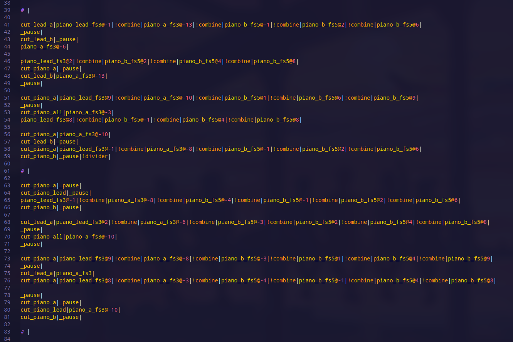

# A small guide on creating Thirty Dollar Covers using text only.
## Introduction

Hello! In this guide I'll show you how I make my own covers in the Thirty Dollar Website. 
I mainly use the Thirty Dollar Tools' custom `#define` extension to help me quite a bit 
with editing the cover itself but you can follow this guide without using it 
and the methods will still work. 
Before starting I highly recommend that you read the 
[Thirty Dollar Tools wiki's pages about the Thirty Dollar Save Format and the Custom TDWex extensions here](https://github.com/t1stm/ThirtyDollarTools/wiki). 
I won't bother explaining anything in this tutorial that is already mentioned in the wiki. 
I've put some links if you decide that it's too much for you, but I've warned you.

## Find a good source / recreation for you to use

This is in my opinion one of the most important steps you can take before 
actually starting to make a cover in the TDW. 
Without having a good source most of the time you're going to make your accuracy and/or experience 
in making the cover itself worse (unless you actually enjoy a challenge, like me). 
Try to find stems / sheet music / whatever recreation that exists of the song 
so that you can better organize the instruments you'll use. I don't have much experience with 
making covers without a source, so if you can't find one you're on your own for the following steps.

## Separate your instruments to patterns

Most songs have different parts in their composition. 
My recommendation is that you split the different instrument layouts into patterns 
so that you can reuse in more of the parts that you recreate. Let's say that for example 
there's a repeating bass pattern in the song, instead of repeating it over and over, 
define a pattern for it and use the pattern instead. 
See the screenshot below showcasing an FL Studio project with different patterns.


You can also see the video of the recreation here: https://www.youtube.com/watch?v=S0QjVTvAROk

## Defining your instruments

Now that you've split the instruments in the cover by patterns, it's a good time to also 
choose the TDW sounds that you'll use for each instrument and pattern. For example 
see these two screenshots.

Firstly put all sounds that the instrument will use:


And then to get the sounds' IDs in the save file press CTRL+ALT+S to export to the browser's view.


### Defining sounds in the Thirty Dollar Tools

The Thirty Dollar Tools support creating "sound defines" by specifying the used sounds 
and them using them by their new name. The Thirty Dollar Tools already have a wiki page 
for this, [which you can see here.](https://github.com/t1stm/ThirtyDollarTools/wiki/The-TDWex-fomat-(ThirtyDollarTools-Custom-Extensions)#the-define-event)

In short if you want to specify a #define, you use this:

```
#define(my_cool_sound)|
noteblock_harp|!combine|noteblock_pling|
#enddefine|

# Now using the define. |
my_cool_sound@2%60^-10|
```

Now with this basic explanation done, we can move over to the explanation of how I write 
and order everything.

# How I layout my covers.

### The start of a cover's save file

My layout is pretty descriptive about the structure of the song I write. 
Most of the rules can be visible just with the naked eye. 
Here's a snippet that explains what I do when writing covers.

I first start by defining the sounds. 
I use comments to separate different instruments into their own _subcategory_. 

I also use the pretty much default key `F#` of the Thirty Dollar Website as a base for instruments 
like pianos, trumpets, synths, etc. For other deep instruments like slap bass I use the key `C3`. 
I don't add any key to the drums.

I also like to add `_fs4` for example to show that the sound is in `F#4` when the value is 0.

For individually cutting sounds, I define an #icut event that is descriptive enough to 
tell what it does by eye. For example if you have defined a sound that's called 
`synth_hard_fs5` -> `cut_synth_hard`

```ruby
# This is the start of the file. I'll mark different parts with comments like these. 
# I format comments with a hash "#" and a space after them. 
# Hashes without spaces after them are TDWex commands. 
# Don't worry if you like to write comments without a space in them. 
# If it's not a valid command the parser will ignore it. |

# Pianos |

#define(piano_soft_fs5)|
noteblock_harp|!combine|noteblock_pling%60|
#enddefine|

#define(cut_piano_soft)|
#icut(noteblock_harp, noteblock_pling)| # you can also use !cut@ here, but I don't think that it officially supports cutting more than one sound, so in this case I use the TDWex variant. |
#enddefine|

#define(piano_hard_fs5)|
builttoscale@-6| # Here I pitched down the builttoscale so that it's in key with the other piano. |
#enddefine|

# Bass |

#define(bass_fs2)|
noteblock_bass@-24|!combine|noteblock_guitar@-24|
#enddefine|

#define(cut_bass)|
#icut(noteblock_bass, noteblock_guitar)|
#enddefine|

# Drums |

#define(kick)|
adofaikick%60|
#enddefine|

# Other |
#define(new_sound_etc)|
...
```

### The layout of a sequence

This section will show off how I format the sequence itself after I've made the defines. 
I'll mostly keep on using the defines I've made above.

To explain it briefly, I format the subdivisions, beats and measures like this.

- Each subdivision is on its own line.
- Each beat is separated by one line.
- Each measure has it's beginnings and ends marked and has spaces that separate it.

Or if you want to see it in action here's an example:

```ruby
...
#enddefine|

# Start of the Cover:

!speed@145|!speed@4@x|!divider|

# Below this marks the start of the first measure. 
# This measure has 4 beats and each beat has 4 subdivisions / 16th notes. 
# In some cases I increase the amount of subdivisions to 8 per beat. 
# This comment is the main way I differentiate and format the file so that different parts
# align together without any problems. "_pause" is "Silence" in the TDW. |

# 1 |

kick|
_pause|
_pause|
_pause|

_pause|
_pause|
kick|
_pause|

kick|
_pause|
_pause|
kick|

_pause|
kick|
_pause|
_pause|


# If I have different timers I add / subtract the number of beats in a measure. 
# For example I'll format this beat like it's 5/4ths. |
# 2 |

kick|
_pause|
_pause|
kick|

_pause|
_pause|
kick|
_pause|

_pause|
kick|
_pause|
kick|

_pause|
kick|
_pause|
_pause|

kick|
_pause|
kick|
_pause|

# 3 | # This is the end of this example. |
```

## Cool but how does this align together with another sequence / instrument?

Worry not. I'll show you.

In short, since we're using very strict formatting just copy-pasting the lines next to each other 
and putting `|!combine|` in between them will cause them to be merged. 
I'll show you what I mean in a screenshot from my Death by Glamour cover below.

I have three instruments in these eight measures that I want to merge. A basic kick pattern, 
some pianos and strings. They all have different lengths, but it'll still work, 
you just have to lay them out right. Let's start with the length of each pattern.

### The Drum Pattern

It's 1 measure long and looks like this. 


### The Piano Pattern

This one is two measures long. Here's how it looks:


### The Strings Pattern

The strings pattern is eight measures long. After stacking the previous ones 
we should continue to combine this one. I've attached a closeup of a part that changes 
and the full pattern.


This is the full pattern.


## How to merge patterns.

First off start with the shortest pattern and repeat it enough times so that it covers the 
second shortest exactly. In this case I'll have to duplicate the drum pattern once, 
so that we have it repeat twice in order to merge it with the piano pattern.

I've attached a screenshot that shows how to order them. You can see how the drum pattern 
repeats twice. When merging them you must use `|!combine|` inbetween the two. 
This image just shows how the patterns align. **NOTE: The screenshot isn't 100% accurate. 
You mustn't use `!divider`s in pattern files since they create a new beat when not used with `|!combine|`**


Now do the same for the newly merged pattern and the strings one to create the final result.


Or if you want to see it in final form with dividers and proper beat formattings, here's the screenshot.


# The tools I use.

I have a small HTML page that has three input fields in it. 
You paste in the content of each pattern, making sure that the formatting is correct, 
and in a result box below, you get your wanted output. 
You can find the HTML file here: [Merge Tool Link](./merge-tool.html). 

Here's a screenshot of the site:

